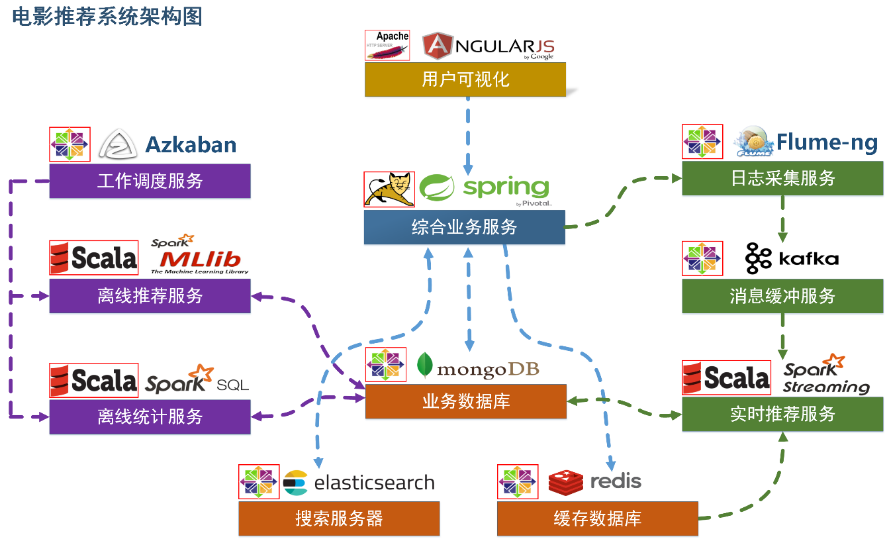
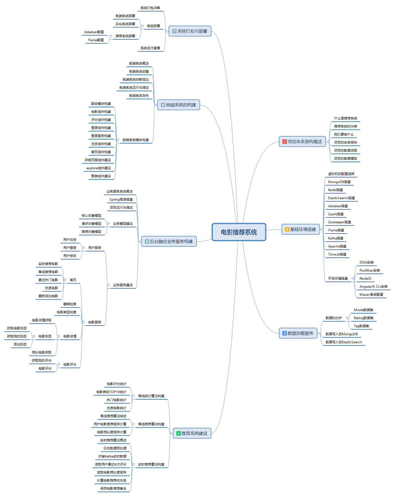

# MovieRecommendSystem
>基于spark的电影离线和实时推荐系统

### 项目系统架构图
项目以推荐系统建设领域知名的经过修改过的MovieLens数据集作为依托，以某科技公司电影网站真实业务数据架构为基础，构建了符合教学体系的一体化的电影推荐系统，包含了离线推荐与实时推荐体系，综合利用了协同过滤算法以及基于内容的推荐方法来提供混合推荐。提供了从前端应用、后台服务构建、算法设计实现、平台部署等多方位的闭环的业务实现。  

### 整个项目脑图结构
- 【用户可视化】  主要负责实现和用户的交互以及业务数据的展示，主体采用AngularJS2进行实现，部署在Apache服务上。
- 【综合业务服务】 主要实现JavaEE层面整体的业务逻辑，通过Spring进行构建，对接业务需求。部署在Tomcat上。
- 【数据存储部分】
    1. 业务数据库：项目采用广泛应用的文档数据库MongDB作为主数据库，主要负责平台业务逻辑数据的存储。
    2. 搜索服务器：项目爱用ElasticSearch作为模糊检索服务器，通过利用ES强大的匹配查询能力实现基于内容的推荐服务。
    3. 缓存数据库：项目采用Redis作为缓存数据库，主要用来支撑实时推荐系统部分对于数据的高速获取需求。
- 【离线推荐部分】
    1. 离线统计服务：批处理统计性业务采用Spark Core + Spark SQL进行实现，实现对指标类数据的统计任务。
    2. 离线推荐服务：离线推荐业务采用Spark Core + Spark MLlib进行实现，采用ALS算法进行实现。
    3. 工作调度服务：对于离线推荐部分需要以一定的时间频率对算法进行调度，采用Azkaban进行任务的调度。
- 【实时推荐部分】
    1. 日志采集服务：通过利用Flume-ng对业务平台中用户对于电影的一次评分行为进行采集，实时发送到Kafka集群。
    2. 消息缓冲服务：项目采用Kafka作为流式数据的缓存组件，接受来自Flume的数据采集请求。并将数据推送到项目的实时推荐系统部分。
    3. 实时推荐服务：项目采用Spark Streaming作为实时推荐系统，通过接收Kafka中缓存的数据，通过设计的推荐算法实现对实时推荐的数据处理，并将结构合并更新到MongoDB数据库。

